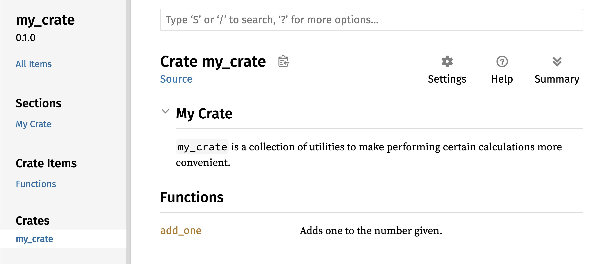

## 将 crate 发布到 Crates.io

我们已经把 [crates.io](https://crates.io/) 上的软件包用作项目依赖，但你也可以发布自己的软件包，与其他人分享代码。[crates.io](https://crates.io/) 上的 crate 注册表会分发软件包的源代码，因此主要托管开源代码。

Rust 和 Cargo 提供了一些功能，让人们更容易找到并使用你发布的软件包。接下来会讨论其中一些功能，再说明如何发布软件包。

### 编写有用的文档注释

准确记录软件包有助于其他用户了解何时以及如何使用它们，因此值得投入时间编写文档。第 3 章讨论了如何使用两个斜杠 `//` 注释 Rust 代码。Rust 还有一种专用于文档的注释，称为<em>文档注释(documentation comment)</em>，它会生成 HTML 文档。HTML 会显示公有 API 条目的文档注释内容，面向希望了解如何<em>使用</em> crate，而不是 crate 如何<em>实现</em>的程序员。

文档注释使用三个斜杠 `///` 而不是两个，并支持 Markdown 标记来格式化文本。请把文档注释放在它所记录的条目之前。示例 14-1 展示了名为 `my_crate` 的 crate 中 `add_one` 函数的文档注释。

<Listing number="14-1" file-name="src/lib.rs" caption="函数的文档注释">

```rust,ignore
{{#rustdoc_include ../../listings/ch14-more-about-cargo/listing-14-01/src/lib.rs}}
```

</Listing>

这里，我们描述了 `add_one` 函数的作用，创建标题为 `Examples` 的一节，再提供展示如何使用 `add_one` 函数的代码。可以运行 `cargo doc`，根据该文档注释生成 HTML 文档。此命令会运行随 Rust 分发的 `rustdoc` 工具，并把生成的 HTML 文档放入 <em>target/doc</em> 目录。

为了方便，运行 `cargo doc --open` 会构建当前 crate 文档（以及所有 crate 依赖文档）的 HTML，并在 Web 浏览器中打开结果。导航到 `add_one` 函数，就会看到文档注释中的文本如何渲染，如图 14-1 所示。


<span class="caption">图 14-1：`add_one` 函数的 HTML 文档</span>

#### 常用章节

示例 14-1 使用 Markdown 标题 `# Examples`，在 HTML 中创建标题为“Examples”的一节。crate 作者还经常在文档中使用以下几节：

- <strong>Panics</strong>：所记录的函数可能发生 panic 的场景。不希望程序 panic 的调用者应确保不要在这些情况下调用函数。
- <strong>Errors</strong>：如果函数返回 `Result`，描述可能发生的错误种类和导致这些错误返回的条件，会帮助调用者编写代码，以不同方式处理不同种类的错误。
- <strong>Safety</strong>：如果调用函数是 `unsafe` 的（第 20 章会讨论不安全性），应该用一节解释函数为何不安全，并说明函数要求调用者维护哪些不变量。

大多数文档注释不需要全部这些章节，但这份清单可以提醒你，用户会对代码的哪些方面感兴趣。

<a id="documentation-comments-as-tests"></a>

#### 把文档注释作为测试

在文档注释中添加示例代码块，不仅有助于展示如何使用库，还有一项额外好处：运行 `cargo test` 会把文档中的代码示例作为测试执行！没有什么比带示例的文档更好；但如果代码在文档编写后发生变化，导致示例无法工作，也没有什么比这种示例更糟。对示例 14-1 中带有 `add_one` 函数文档的代码运行 `cargo test`，测试结果中会出现类似以下内容的部分：

<!-- manual-regeneration
cd listings/ch14-more-about-cargo/listing-14-01/
cargo test
copy just the doc-tests section below
-->

```text
   Doc-tests my_crate

running 1 test
test src/lib.rs - add_one (line 5) ... ok

test result: ok. 1 passed; 0 failed; 0 ignored; 0 measured; 0 filtered out; finished in 0.27s
```

现在，如果修改函数或示例，使示例中的 `assert_eq!` 发生 panic，再次运行 `cargo test` 时，就会看到文档测试捕获了示例与代码不同步的问题！

<!-- Old headings. Do not remove or links may break. -->

<a id="commenting-contained-items"></a>

#### 为包含注释的条目编写注释

`//!` 风格的文档注释会为<em>包含</em>这些注释的条目添加文档，而不是为注释<em>之后</em>的条目添加文档。我们通常在 crate 根文件（按照惯例是 <em>src/lib.rs</em>）或模块内部使用这类文档注释，记录整个 crate 或模块。

例如，要添加描述包含 `add_one` 函数的 `my_crate` crate 用途的文档，我们会在 <em>src/lib.rs</em> 文件开头添加以 `//!` 起始的文档注释，如示例 14-2 所示。

<Listing number="14-2" file-name="src/lib.rs" caption="`my_crate` crate 整体的文档">

```rust,ignore
{{#rustdoc_include ../../listings/ch14-more-about-cargo/listing-14-02/src/lib.rs:here}}
```

</Listing>

请注意，以 `//!` 开头的最后一行之后没有任何代码。由于注释以 `//!` 而不是 `///` 开头，我们记录的是包含该注释的条目，而不是注释之后的条目。在这里，该条目是 crate 根文件 <em>src/lib.rs</em>。这些注释描述整个 crate。

运行 `cargo doc --open` 时，这些注释会显示在 `my_crate` 文档首页中 crate 公有条目列表的上方，如图 14-2 所示。

条目内部的文档注释尤其适合描述 crate 和模块。使用它们说明容器的整体用途，帮助用户理解 crate 的组织方式。



<span class="caption">图 14-2：`my_crate` 渲染后的文档，其中包含描述整个 crate 的注释</span>

<!-- Old headings. Do not remove or links may break. -->

<a id="exporting-a-convenient-public-api-with-pub-use"></a>

<a id="exporting-a-convenient-public-api"></a>

### 导出便于使用的公有 API

发布 crate 时，公有 API 的结构是一项重要考量。使用 crate 的人不如你熟悉其结构；如果 crate 的模块层次很庞大，他们可能难以找到想要使用的部分。

第 7 章介绍了如何使用 `pub` 关键字把条目设为公有，以及如何使用 `use` 关键字把条目引入作用域。然而，开发 crate 时对你来说合理的结构，对用户而言可能并不方便。你可能希望把结构体组织到包含多层的层次结构中，但想使用层次深处某个类型的人可能难以发现它的存在。相比输入 `use my_crate::UsefulType;`，必须输入 `use my_crate::some_module::another_module::UsefulType;` 也可能令他们感到烦恼。

好消息是，如果其他库使用该结构时<em>不够</em>方便，无需重新排列内部组织方式。可以使用 `pub use` 重新导出条目，创建不同于私有结构的公有结构。<em>重新导出(re-exporting)</em>会取得某个位置的公有条目，并使其在另一个位置也成为公有，就像它原本定义在那里一样。

例如，假设创建一个名为 `art`、用于建模艺术概念的库。库中有两个模块：`kinds` 模块包含名为 `PrimaryColor` 和 `SecondaryColor` 的两个枚举，`utils` 模块包含名为 `mix` 的函数，如示例 14-3 所示。

<Listing number="14-3" file-name="src/lib.rs" caption="`art` 库，其中的条目组织在 `kinds` 和 `utils` 模块中">

```rust,noplayground,test_harness
{{#rustdoc_include ../../listings/ch14-more-about-cargo/listing-14-03/src/lib.rs:here}}
```

</Listing>

图 14-3 展示了 `cargo doc` 为该 crate 生成的文档首页。


<span class="caption">图 14-3：`art` 文档首页，其中列出 `kinds` 和 `utils` 模块</span>

请注意，首页没有列出 `PrimaryColor` 和 `SecondaryColor` 类型，也没有列出 `mix` 函数。必须点击 `kinds` 和 `utils` 才能看到它们。

依赖该库的其他 crate 需要使用 `use` 语句把 `art` 中的条目引入作用域，并指定当前定义的模块结构。示例 14-4 展示了一个使用 `art` crate 中 `PrimaryColor` 和 `mix` 条目的 crate。

<Listing number="14-4" file-name="src/main.rs" caption="一个使用 `art` crate 条目的 crate，其中导出了其内部结构">

```rust,ignore
{{#rustdoc_include ../../listings/ch14-more-about-cargo/listing-14-04/src/main.rs}}
```

</Listing>

使用 `art` crate 的示例 14-4 代码作者必须弄清 `PrimaryColor` 位于 `kinds` 模块，而 `mix` 位于 `utils` 模块。`art` crate 的模块结构与开发该 crate 的人更加相关，与使用它的人关系不大。内部结构并未向尝试理解如何使用 `art` crate 的人提供有用信息，反而会造成困惑，因为使用它的开发者必须弄清应该去哪里查找，还必须在 `use` 语句中指定模块名。

为了从公有 API 中移除内部组织结构，可以修改示例 14-3 中的 `art` crate 代码，添加 `pub use` 语句，在顶层重新导出条目，如示例 14-5 所示。

<Listing number="14-5" file-name="src/lib.rs" caption="添加 `pub use` 语句重新导出条目">

```rust,ignore
{{#rustdoc_include ../../listings/ch14-more-about-cargo/listing-14-05/src/lib.rs:here}}
```

</Listing>

现在，`cargo doc` 为该 crate 生成的 API 文档会在首页列出重新导出的条目并提供链接，如图 14-4 所示，使 `PrimaryColor`、`SecondaryColor` 类型和 `mix` 函数更容易找到。


<span class="caption">图 14-4：`art` 文档首页，其中列出重新导出的条目</span>

`art` crate 的用户仍可查看并使用示例 14-3 中的内部结构，如示例 14-4 所示；也可以使用示例 14-5 中更方便的结构，如示例 14-6 所示。

<Listing number="14-6" file-name="src/main.rs" caption="使用 `art` crate 重新导出条目的程序">

```rust,ignore
{{#rustdoc_include ../../listings/ch14-more-about-cargo/listing-14-06/src/main.rs:here}}
```

</Listing>

如果有许多嵌套模块，使用 `pub use` 在顶层重新导出类型，会显著改善 crate 用户的体验。`pub use` 的另一种常见用途，是在当前 crate 中重新导出某个依赖的定义，使该 crate 的定义成为你自己的 crate 公有 API 的一部分。

创建实用的公有 API 结构更像是一门艺术，而不是精确科学；你可以反复调整，找出最适合用户的 API。选择 `pub use` 让你能够灵活组织 crate 内部，并将内部结构与展示给用户的结构解耦。请查看一些已安装 crate 的代码，看看它们的内部结构是否不同于公有 API。

### 设置 Crates.io 账户

发布任何 crate 之前，需要在 [crates.io](https://crates.io/) 创建账户并取得 API 令牌。为此，请访问 [crates.io](https://crates.io/) 首页并通过 GitHub 账户登录。（目前 GitHub 账户是必需的，但网站未来可能支持其他创建账户的方式。）登录后，前往 [https://crates.io/me/](https://crates.io/me/) 的账户设置，取得 API 密钥。然后运行 `cargo login` 命令，并在提示时粘贴 API 密钥：

```console
$ cargo login
abcdefghijklmnopqrstuvwxyz012345
```

该命令会把 API 令牌告知 Cargo，并将其存储在本地的 <em>~/.cargo/credentials.toml</em> 中。请注意，该令牌是秘密信息：不要与任何其他人分享。如果出于任何原因分享了它，应立即在 [crates.io](https://crates.io/) 上撤销令牌并生成新令牌。

### 向新 crate 添加元数据

假设有一个想要发布的 crate。发布前，需要在 crate 的 <em>Cargo.toml</em> 文件 `[package]` 部分添加一些<em>元数据(metadata)</em>。

crate 需要唯一名称。在本地开发 crate 时，可以随意命名；但 [crates.io](https://crates.io/) 上的 crate 名称按照先到先得分配。一旦某个名称被占用，其他人就无法以该名称发布 crate。尝试发布前，请搜索想使用的名称。如果已被使用，就需要寻找其他名称，并编辑 <em>Cargo.toml</em> 文件 `[package]` 部分中的 `name` 字段，使用新名称发布：

<span class="filename">文件名：Cargo.toml</span>

```toml
[package]
name = "guessing_game"
```

即使选择了唯一名称，如果此时运行 `cargo publish` 发布 crate，也会先得到警告，再得到错误：

<!-- manual-regeneration
Create a new package with an unregistered name, making no further modifications
  to the generated package, so it is missing the description and license fields.
cargo publish
copy just the relevant lines below
-->

```console
$ cargo publish
    Updating crates.io index
warning: manifest has no description, license, license-file, documentation, homepage or repository.
See https://doc.rust-lang.org/cargo/reference/manifest.html#package-metadata for more info.
--snip--
error: failed to publish to registry at https://crates.io

Caused by:
  the remote server responded with an error (status 400 Bad Request): missing or empty metadata fields: description, license. Please see https://doc.rust-lang.org/cargo/reference/manifest.html for more information on configuring these fields
```

之所以出错，是因为缺少一些关键信息：描述和许可证是必需的，让人们知道 crate 的作用以及可以按什么条款使用它。在 <em>Cargo.toml</em> 中添加一两句描述，因为它会与 crate 一起出现在搜索结果中。对于 `license` 字段，需要提供<em>许可证标识符(license identifier)</em>值。[Linux 基金会的软件包数据交换（SPDX）][spdx]列出了可以用于该值的标识符。例如，要指定 crate 使用 MIT License 授权，请添加 `MIT` 标识符：

<span class="filename">文件名：Cargo.toml</span>

```toml
[package]
name = "guessing_game"
license = "MIT"
```

如果想使用未列入 SPDX 的许可证，需要把许可证文本放入文件，将该文件包含在项目中，再使用 `license-file` 指定文件名，而不是使用 `license` 键。

选择适合项目的许可证不在本书讨论范围之内。Rust 社区中的许多人采用与 Rust 相同的方式，使用 `MIT OR Apache-2.0` 双重许可证为项目授权。这也说明，可以用 `OR` 分隔多个许可证标识符，为项目指定多个许可证。

添加唯一名称、版本、描述和许可证后，准备发布项目的 <em>Cargo.toml</em> 文件可能如下所示：

<span class="filename">文件名：Cargo.toml</span>

```toml
[package]
name = "guessing_game"
version = "0.1.0"
edition = "2024"
description = "A fun game where you guess what number the computer has chosen."
license = "MIT OR Apache-2.0"

[dependencies]
```

[Cargo 文档](https://doc.rust-lang.org/cargo/)描述了可以指定的其他元数据，帮助其他人更容易发现和使用你的 crate。

### 发布到 Crates.io

现在，你已经创建账户、保存 API 令牌、为 crate 选择名称并指定必要元数据，可以发布了！发布 crate 会把特定版本上传到 [crates.io](https://crates.io/)，供其他人使用。

请务必谨慎，因为发布是<em>永久的</em>。版本永远无法被覆盖，除某些特殊情况外，代码也不能删除。Crates.io 的一个主要目标，是充当永久代码档案，确保依赖 [crates.io](https://crates.io/) 上 crate 的所有项目都能持续构建。允许删除版本将无法实现这一目标。不过，可以发布的 crate 版本数量没有限制。

再次运行 `cargo publish` 命令。现在应该能够成功：

<!-- manual-regeneration
go to some valid crate, publish a new version
cargo publish
copy just the relevant lines below
-->

```console
$ cargo publish
    Updating crates.io index
   Packaging guessing_game v0.1.0 (file:///projects/guessing_game)
    Packaged 6 files, 1.2KiB (895.0B compressed)
   Verifying guessing_game v0.1.0 (file:///projects/guessing_game)
   Compiling guessing_game v0.1.0
(file:///projects/guessing_game/target/package/guessing_game-0.1.0)
    Finished `dev` profile [unoptimized + debuginfo] target(s) in 0.19s
   Uploading guessing_game v0.1.0 (file:///projects/guessing_game)
    Uploaded guessing_game v0.1.0 to registry `crates-io`
note: waiting for `guessing_game v0.1.0` to be available at registry
`crates-io`.
You may press ctrl-c to skip waiting; the crate should be available shortly.
   Published guessing_game v0.1.0 at registry `crates-io`
```

恭喜！现在，你已经与 Rust 社区分享了代码，任何人都能轻松把你的 crate 添加为项目依赖。

### 发布现有 crate 的新版本

修改 crate 并准备发布新版本时，请修改 <em>Cargo.toml</em> 文件中的 `version` 值，然后重新发布。根据修改的种类，使用[语义化版本控制规则][semver]决定合适的下一个版本号。然后运行 `cargo publish` 上传新版本。

<!-- Old headings. Do not remove or links may break. -->

<a id="removing-versions-from-cratesio-with-cargo-yank"></a>
<a id="deprecating-versions-from-cratesio-with-cargo-yank"></a>

### 从 Crates.io 撤回版本

虽然无法删除 crate 的旧版本，但可以阻止未来项目把它们添加为新依赖。当某个 crate 版本由于某种原因损坏时，这项功能很有用。在这种情况下，Cargo 支持<em>撤回(yanking)</em> crate 版本。

撤回版本会阻止新项目依赖该版本，同时允许所有已经依赖它的项目继续使用。实质上，撤回意味着所有已有 <em>Cargo.lock</em> 的项目不会中断，而未来生成的 <em>Cargo.lock</em> 文件不会使用已撤回版本。

要撤回某个 crate 版本，请在之前发布该 crate 的目录中运行 `cargo yank`，并指定要撤回的版本。例如，如果已经发布名为 `guessing_game`、版本为 1.0.1 的 crate，并希望撤回它，就在 `guessing_game` 项目目录中运行：

<!-- manual-regeneration:
cargo yank carol-test --version 2.1.0
cargo yank carol-test --version 2.1.0 --undo
-->

```console
$ cargo yank --vers 1.0.1
    Updating crates.io index
        Yank guessing_game@1.0.1
```

为命令添加 `--undo`，还可以撤销撤回操作，再次允许项目开始依赖该版本：

```console
$ cargo yank --vers 1.0.1 --undo
    Updating crates.io index
      Unyank guessing_game@1.0.1
```

撤回操作<em>不会</em>删除任何代码。例如，它无法删除意外上传的秘密信息。如果发生这种情况，必须立即重置这些秘密。

[spdx]: https://spdx.org/licenses/
[semver]: https://semver.org/
