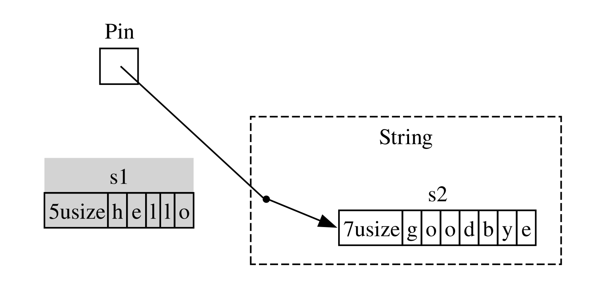

<!-- Old headings. Do not remove or links may break. -->

<a id="digging-into-the-traits-for-async"></a>

## 深入了解异步 Trait

本章一直以各种方式使用 `Future`、`Stream` 和 `StreamExt` trait。不过，到目前为止，我们一直避免过度深入它们的工作细节以及相互关系；对于日常 Rust 工作，大多数时候这样就足够了。但有时你会遇到需要进一步了解这些 trait 的部分细节，以及 `Pin` 类型和 `Unpin` trait 的情况。本节将深入到足以帮助处理这些场景的程度，而把<em>真正</em>深入的探讨留给其他文档。

<!-- Old headings. Do not remove or links may break. -->

<a id="future"></a>

### `Future` Trait

先仔细看看 `Future` trait 如何工作。Rust 对它的定义如下：

```rust
use std::pin::Pin;
use std::task::{Context, Poll};

pub trait Future {
    type Output;

    fn poll(self: Pin<&mut Self>, cx: &mut Context<'_>) -> Poll<Self::Output>;
}
```

这个 trait 定义包含许多新类型和一些之前未见过的语法，下面逐部分分析。

首先，`Future` 的关联类型 `Output` 表明 future 会解析为什么。这类似于 `Iterator` trait 的关联类型 `Item`。其次，`Future` 有一个 `poll` 方法，其 `self` 形参接收特殊的 `Pin` 引用，另一个形参接收对 `Context` 类型的可变引用，并返回 `Poll<Self::Output>`。稍后会进一步讨论 `Pin` 和 `Context`。现在先关注该方法返回的 `Poll` 类型：

```rust
pub enum Poll<T> {
    Ready(T),
    Pending,
}
```

`Poll` 类型与 `Option` 相似：它有一个包含值的变体 `Ready(T)`，以及一个不包含值的变体 `Pending`。不过，`Poll` 的含义与 `Option` 大不相同！`Pending` 变体表示 future 仍有工作要做，所以调用方稍后需要再次检查。`Ready` 变体则表示 `Future` 已完成工作，`T` 值已经可用。

> 注意：很少需要直接调用 `poll`；但如果确实需要，请记住，对于大多数 future，一旦它返回 `Ready`，调用方就不应再次调用 `poll`。许多 future 在就绪后再次被轮询会 panic。能够安全地再次轮询的 future 会在文档中明确说明。这与 `Iterator::next` 的行为相似。

当看到使用 `await` 的代码时，Rust 会在底层把它编译为调用 `poll` 的代码。回看示例 17-4，我们在单个 URL 解析完成后打印其页面标题。Rust 会把它编译成大致（但不完全）类似以下的代码：

```rust,ignore
match page_title(url).poll() {
    Ready(page_title) => match page_title {
        Some(title) => println!("The title for {url} was {title}"),
        None => println!("{url} had no title"),
    }
    Pending => {
        // But what goes here?
    }
}
```

future 仍为 `Pending` 时应当怎么做？我们需要某种方式不断重试，直到 future 最终就绪。换句话说，需要一个循环：

```rust,ignore
let mut page_title_fut = page_title(url);
loop {
    match page_title_fut.poll() {
        Ready(value) => match page_title {
            Some(title) => println!("The title for {url} was {title}"),
            None => println!("{url} had no title"),
        }
        Pending => {
            // continue
        }
    }
}
```

不过，如果 Rust 确实编译成这样的代码，每个 `await` 都会阻塞，这恰恰与目标背道而驰！相反，Rust 会确保该循环能够把控制权交给某种东西：它可以暂停当前 future 上的工作，转而处理其他 future，稍后再回来检查这个 future。正如我们已经看到的，这个东西就是异步运行时；这种调度和协调工作正是其主要职责之一。

在[“使用消息传递在两个任务间发送数据”][message-passing]<!-- ignore -->一节，我们描述了等待 `rx.recv`。`recv` 调用返回一个 future，等待该 future 就会对它进行轮询。我们提到，运行时会暂停该 future，直到它在消息到达时以 `Some(message)` 就绪，或在通道关闭时以 `None` 就绪。进一步理解 `Future` trait，特别是 `Future::poll` 后，就能看出它的工作方式。当 future 返回 `Poll::Pending` 时，运行时知道它尚未就绪。反过来，当 `poll` 返回 `Poll::Ready(Some(message))` 或 `Poll::Ready(None)` 时，运行时知道 future <em>已经</em>就绪，并推进它。

运行时如何完成这些工作的确切细节超出了本书范围，但关键在于理解 future 的基本机制：运行时会<em>轮询</em>自己负责的每个 future；如果尚未就绪，就让该 future 重新休眠。

<!-- Old headings. Do not remove or links may break. -->

<a id="pinning-and-the-pin-and-unpin-traits"></a>
<a id="the-pin-and-unpin-traits"></a>

### `Pin` 类型与 `Unpin` Trait

在示例 17-13 中，我们使用 `trpl::join!` 宏等待三个 future。然而，常见情况是拥有一个集合（例如向量），其中包含直到运行时才能确定数量的 future。把示例 17-13 修改为示例 17-23 中的代码：将三个 future 放入向量，并改为调用 `trpl::join_all` 函数；不过它暂时无法编译。

<Listing number="17-23" caption="等待集合中的 future" file-name="src/main.rs">

```rust,ignore,does_not_compile
{{#rustdoc_include ../../listings/ch17-async-await/listing-17-23/src/main.rs:here}}
```

</Listing>

我们把每个 future 放入 `Box`，将其变成<em>特征对象(trait object)</em>，就像第 12 章“从 `run` 返回错误”一节所做的一样。（第 18 章将详细介绍特征对象。）使用特征对象，可以把这些类型产生的每个匿名 future 当作相同类型处理，因为它们都实现 `Future` trait。

这可能令人惊讶。毕竟，所有 async 块都不返回任何内容，所以每个都会产生 `Future<Output = ()>`。不过请记住，`Future` 是 trait，而且编译器会为每个 async 块创建独一无二的枚举，即使它们的输出类型相同。正如不能把两个不同的手写结构体放进同一个 `Vec`，也不能混合编译器生成的不同枚举。

然后，我们把 future 集合传给 `trpl::join_all` 函数并等待结果。然而，这段代码无法编译；下面是错误消息中的相关部分。

<!-- manual-regeneration
cd listings/ch17-async-await/listing-17-23
cargo build
copy *only* the final `error` block from the errors
-->

```text
error[E0277]: `dyn Future<Output = ()>` cannot be unpinned
  --> src/main.rs:48:33
   |
48 |         trpl::join_all(futures).await;
   |                                 ^^^^^ the trait `Unpin` is not implemented for `dyn Future<Output = ()>`
   |
   = note: consider using the `pin!` macro
           consider using `Box::pin` if you need to access the pinned value outside of the current scope
   = note: required for `Box<dyn Future<Output = ()>>` to implement `Future`
note: required by a bound in `futures_util::future::join_all::JoinAll`
  --> file:///home/.cargo/registry/src/index.crates.io-1949cf8c6b5b557f/futures-util-0.3.30/src/future/join_all.rs:29:8
   |
27 | pub struct JoinAll<F>
   |            ------- required by a bound in this struct
28 | where
29 |     F: Future,
   |        ^^^^^^ required by this bound in `JoinAll`
```

这条错误消息中的说明告诉我们，应使用 `pin!` 宏<em>固定(pin)</em>这些值，也就是把它们放入 `Pin` 类型中，保证这些值不会在内存中移动。错误消息指出，需要固定是因为 `dyn Future<Output = ()>` 必须实现 `Unpin` trait，而它目前没有实现。

`trpl::join_all` 函数返回名为 `JoinAll` 的结构体。该结构体对类型 `F` 泛型化，并约束 `F` 必须实现 `Future` trait。直接使用 `await` 等待 future 会隐式固定该 future。这就是为何不需要在每个等待 future 的地方都使用 `pin!`。

然而，这里不是直接等待一个 future，而是把 future 集合传给 `join_all` 函数，从而构造一个新的 future `JoinAll`。`join_all` 的签名要求集合中各项的类型全部实现 `Future` trait，而 `Box<T>` 只有在它包裹的 `T` 是实现了 `Unpin` trait 的 future 时，才实现 `Future`。

这包含的信息很多！要真正理解它，需要进一步探究 `Future` trait 实际如何工作，尤其是固定方面。再次查看 `Future` trait 的定义：

```rust
use std::pin::Pin;
use std::task::{Context, Poll};

pub trait Future {
    type Output;

    // Required method
    fn poll(self: Pin<&mut Self>, cx: &mut Context<'_>) -> Poll<Self::Output>;
}
```

`cx` 形参及其 `Context` 类型，是运行时在保持惰性的同时，实际知道何时检查某个给定 future 的关键。这个过程的细节同样超出本章范围，而且通常只有在编写自定义 `Future` 实现时才需要考虑。我们转而关注 `self` 的类型，因为这是第一次看到带类型标注的 `self` 方法。`self` 的类型标注与其他函数形参的类型标注工作方式相同，但有两个关键区别：

- 它告诉 Rust，要调用这个方法，`self` 必须是什么类型。
- 它不能是任意类型，只能是实现该方法的类型、指向该类型的引用或智能指针，或者包裹着指向该类型之引用的 `Pin`。

[第 18 章][ch-18]<!-- ignore -->将进一步介绍这种语法。现在只需知道，如果要轮询 future，检查它是 `Pending` 还是 `Ready(Output)`，就需要一个由 `Pin` 包裹、指向该类型的可变引用。

`Pin` 是 `&`、`&mut`、`Box` 和 `Rc` 等类指针类型的包装器。（严格来说，`Pin` 适用于实现 `Deref` 或 `DerefMut` trait 的类型，但实际上这等价于只处理引用和智能指针。）`Pin` 本身不是指针，也不像 `Rc` 和 `Arc` 通过引用计数拥有自己的行为；它纯粹是一种工具，编译器可以用它执行对指针使用方式的约束。

回想 `await` 是通过调用 `poll` 实现的，这开始解释之前看到的错误消息；但那条消息谈的是 `Unpin`，而不是 `Pin`。那么 `Pin` 与 `Unpin` 究竟有何关系？为什么 `Future` 需要把 `self` 放在 `Pin` 类型中才能调用 `poll`？

还记得本章前面介绍过，future 中的一系列等待点会被编译为状态机；编译器确保该状态机遵循 Rust 围绕安全（包括借用和所有权）的所有普通规则。为此，Rust 会查看从一个等待点到下一个等待点或 async 块末尾之间需要哪些数据，然后在编译后的状态机中创建对应变体。每个变体都会取得相应源代码部分所需的数据访问权，无论是取得数据的所有权，还是获得指向它的可变或不可变引用。

到目前为止一切顺利：如果在给定 async 块中错误处理了所有权或引用，借用检查器会告诉我们。但当希望移动与该代码块对应的 future 时，例如把它移入 `Vec` 以传给 `join_all`，事情就变得更加棘手。

移动 future，无论是把它推入数据结构以配合 `join_all` 当作迭代器使用，还是从函数返回，实际都意味着移动 Rust 为我们创建的状态机。不同于 Rust 中的大多数其他类型，Rust 为 async 块创建的 future 最终可能在某个变体的字段中包含指向自身的引用，如图 17-4 的简化示意图所示。

<figure>


<figcaption>图 17-4：自引用数据类型</figcaption>

</figure>

不过，默认情况下，任何包含指向自身之引用的对象都不能安全地移动，因为引用始终指向其所引用对象的实际内存地址（见图 17-5）。如果移动数据结构本身，这些内部引用会继续指向旧位置，而该内存位置现在已经无效。一方面，修改数据结构时，该位置的值不会得到更新；另一方面，也是更重要的一点，计算机现在可以自由地把这块内存用于其他用途！之后可能会读到完全不相关的数据。

<figure>


<figcaption>图 17-5：移动自引用数据类型所产生的不安全结果</figcaption>

</figure>

理论上，Rust 编译器可以尝试在对象每次移动时更新指向它的每个引用，但这可能增加大量性能开销，尤其是需要更新整张引用网络时。如果能改为确保相关数据结构<em>不会在内存中移动</em>，就不必更新任何引用。这正是 Rust 借用检查器的职责：在安全代码中，它会阻止移动任何存在活动引用的项。

`Pin` 在此基础上提供了我们所需的确切保证。通过把指向某个值的指针包裹在 `Pin` 中来<em>固定</em>该值后，它就无法再移动。因此，如果有 `Pin<Box<SomeType>>`，实际被固定的是 `SomeType` 值，<em>而不是</em> `Box` 指针。图 17-6 展示了这一过程。

<figure>


<figcaption>图 17-6：固定指向自引用 future 类型的 `Box`</figcaption>

</figure>

事实上，`Box` 指针仍然可以自由移动。请记住：我们关心的是确保最终被引用的数据留在原位。如果指针发生移动，<em>但它指向的数据</em>仍在同一位置，如图 17-7 所示，就不存在潜在问题。（作为独立练习，可以查看相关类型和 `std::pin` 模块的文档，尝试弄清如何用包裹 `Box` 的 `Pin` 实现这一点。）关键在于，自引用类型本身不能移动，因为它仍然被固定。

<figure>


<figcaption>图 17-7：移动指向自引用 future 类型的 `Box`</figcaption>

</figure>

不过，大多数类型即使位于 `Pin` 指针之后，也完全可以安全地移动。只有项包含内部引用时，才需要考虑固定。数字和布尔值等基本值显然没有任何内部引用，所以是安全的。平常在 Rust 中使用的大多数类型同样没有内部引用。例如，可以放心地移动 `Vec`。根据目前所见，如果有 `Pin<Vec<String>>`，即使在没有其他引用时 `Vec<String>` 始终可以安全移动，也必须通过 `Pin` 提供的安全但受限的 API 完成一切操作。我们需要一种方式告诉编译器，在这类情况下移动项没有问题；这正是 `Unpin` 的用武之地。

`Unpin` 是一个标记 trait，类似于第 16 章见过的 `Send` 和 `Sync` trait，因此本身没有任何功能。标记 trait 只用于告诉编译器，在特定上下文中使用实现了给定 trait 的类型是安全的。`Unpin` 告诉编译器，给定类型<em>不</em>需要维持关于相关值能否安全移动的任何保证。

<!--
  The inline `<code>` in the next block is to allow the inline `<em>` inside it,
  matching what NoStarch does style-wise, and emphasizing within the text here
  that it is something distinct from a normal type.
-->

与 `Send` 和 `Sync` 一样，只要编译器能够证明安全，就会自动为类型实现 `Unpin`。同样与 `Send` 和 `Sync` 类似，一种特殊情况是类型<em>没有</em>实现 `Unpin`。其表示法为 <code>impl !Unpin for <em>SomeType</em></code>，其中 <code><em>SomeType</em></code> 是一个类型的名称；每当指向该类型的指针在 `Pin` 中使用时，它<em>确实</em>需要维持这些保证才能确保安全。

换句话说，对于 `Pin` 和 `Unpin` 的关系，需要记住两点。第一，`Unpin` 是“普通”情况，`!Unpin` 是特殊情况。第二，一个类型实现 `Unpin` 还是 `!Unpin`，<em>只有</em>在使用指向该类型的固定指针（例如 <code>Pin<&mut <em>SomeType</em>></code>）时才重要。

为了让这一点具体化，想想 `String`：它包含长度和构成字符串的 Unicode 字符。可以像图 17-8 那样，把 `String` 包裹在 `Pin` 中。不过，与 Rust 中大多数其他类型一样，`String` 会自动实现 `Unpin`。

<figure>


<figcaption>图 17-8：固定一个 `String`；虚线表示 `String` 实现了 `Unpin` trait，因此实际上没有被固定</figcaption>

</figure>

因此，可以执行一些在 `String` 改为实现 `!Unpin` 时不合法的操作，例如像图 17-9 那样，在完全相同的内存位置用另一个字符串替换它。这不违反 `Pin` 契约，因为 `String` 没有使移动变得不安全的内部引用。它实现 `Unpin` 而不是 `!Unpin`，原因正在于此。

<figure>



<figcaption>图 17-9：在内存中用一个完全不同的 `String` 替换原 `String`</figcaption>

</figure>

现在已经足以理解示例 17-23 中 `join_all` 调用所报告的错误。我们最初尝试把 async 块产生的 future 移入 `Vec<Box<dyn Future<Output = ()>>>`，但正如已经看到的，这些 future 可能包含内部引用，因此不会自动实现 `Unpin`。固定它们以后，就可以把得到的 `Pin` 类型放入 `Vec`，并确信 future 中的底层数据<em>不会</em>被移动。示例 17-24 展示了如何在定义三个 future 的每个位置调用 `pin!` 宏，并调整特征对象类型，从而修复代码。

<Listing number="17-24" caption="固定 future，使其能够被移入向量">

```rust
{{#rustdoc_include ../../listings/ch17-async-await/listing-17-24/src/main.rs:here}}
```

</Listing>

这个示例现在可以编译和运行，而且可以在运行时向向量添加或移除 future，并等待它们全部完成。

`Pin` 和 `Unpin` 主要用于构建低级库或运行时本身，而不是日常 Rust 代码。不过，当错误消息中出现这些 trait 时，现在你会更清楚该如何修复代码！

> 注意：`Pin` 和 `Unpin` 的这种组合，使我们能够在 Rust 中安全地实现一整类复杂类型；否则，这些类型会因自引用而极具挑战。如今，需要 `Pin` 的类型最常见于异步 Rust，但偶尔也可能在其他上下文中看到。
>
> `Pin` 和 `Unpin` 如何工作的具体细节，以及它们必须维持的规则，在 `std::pin` 的 API 文档中有详尽介绍；如果有兴趣深入学习，这是一个很好的起点。
>
> 如果希望更详细地理解底层工作方式，请参阅 [《Rust 异步编程》][async-book]的第 [2][under-the-hood]<!-- ignore -->章和第 [4][pinning]<!-- ignore -->章。

### `Stream` Trait

现在已经更深入地理解了 `Future`、`Pin` 和 `Unpin` trait，可以把注意力转向 `Stream` trait。正如本章前面所学，stream 类似于异步迭代器。不过与 `Iterator` 和 `Future` 不同，截至本书编写时，标准库中尚未定义 `Stream`；但 `futures` crate 提供了一种非常常见的定义，整个生态系统都在使用。

在了解 `Stream` trait 如何把 `Iterator` 和 `Future` 结合起来之前，先回顾两者的定义。从 `Iterator` 得到序列的概念：它的 `next` 方法提供 `Option<Self::Item>`。从 `Future` 得到随时间就绪的概念：它的 `poll` 方法提供 `Poll<Self::Output>`。为了表示一系列随时间就绪的项，我们定义一个把这些功能组合起来的 `Stream` trait：

```rust
use std::pin::Pin;
use std::task::{Context, Poll};

trait Stream {
    type Item;

    fn poll_next(
        self: Pin<&mut Self>,
        cx: &mut Context<'_>
    ) -> Poll<Option<Self::Item>>;
}
```

`Stream` trait 定义名为 `Item` 的关联类型，表示 stream 所产生项的类型。这类似于 `Iterator`，其中可以有零到多个项；不同于 `Future`，后者始终只有一个 `Output`，即使它是单元类型 `()`。

`Stream` 还定义一个取得这些项的方法。我们称它为 `poll_next`，以明确表示它像 `Future::poll` 一样进行轮询，并像 `Iterator::next` 一样产生一系列项。其返回类型把 `Poll` 与 `Option` 结合起来。外层类型是 `Poll`，因为必须像 future 一样检查它是否就绪；内层类型是 `Option`，因为它需要像迭代器一样表明是否还有更多消息。

与这个定义非常相似的内容很可能最终会成为 Rust 标准库的一部分。在此之前，它已经是大多数运行时工具集的一部分，因此可以放心依赖；接下来介绍的一切通常也都适用！

不过，在[“Stream：依次产生的 Future”][streams]<!-- ignore -->一节的示例中，我们既没有使用 `poll_next`，也没有使用 `Stream`，而是使用 `next` 和 `StreamExt`。当然，可以直接使用 `poll_next` API，手动编写自己的 `Stream` 状态机，就像可以通过 `poll` 方法直接处理 future 一样。不过，使用 `await` 要方便得多；`StreamExt` trait 提供了 `next` 方法，让我们正好能这样做：

```rust
{{#rustdoc_include ../../listings/ch17-async-await/no-listing-stream-ext/src/lib.rs:here}}
```

<!--
TODO: update this if/when tokio/etc. update their MSRV and switch to using async functions
in traits, since the lack thereof is the reason they do not yet have this.
-->

> 注意：本章前面使用的实际定义看起来与此略有不同，因为它支持尚不能在 trait 中使用异步函数的 Rust 版本。因此，它看起来像这样：
>
> ```rust,ignore
> fn next(&mut self) -> Next<'_, Self> where Self: Unpin;
> ```
>
> 该 `Next` 类型是一个实现 `Future` 的 `struct`，并允许我们用 `Next<'_, Self>` 指明对 `self` 之引用的生命周期，使 `await` 能够配合这个方法工作。

`StreamExt` trait 也是所有可用于 stream 的有趣方法的归属地。每个实现 `Stream` 的类型都会自动实现 `StreamExt`；但这两个 trait 分开定义，让社区可以在不影响基础 trait 的情况下迭代便利 API。

在 `trpl` crate 所使用的 `StreamExt` 版本中，该 trait 不仅定义 `next` 方法，还提供 `next` 的默认实现，正确处理调用 `Stream::poll_next` 的细节。这意味着，即使需要编写自己的流式数据类型，也<em>只</em>需实现 `Stream`，之后使用该数据类型的任何人都能自动对它使用 `StreamExt` 及其方法。

关于这些 trait 的低级细节，我们就介绍到这里。最后，来看看 future（包括 stream）、任务和线程如何融为一体！

[message-passing]: ch17-02-concurrency-with-async.html#sending-data-between-two-tasks-using-message-passing
[ch-18]: ch18-00-oop.html
[async-book]: https://rust-lang.github.io/async-book/
[under-the-hood]: https://rust-lang.github.io/async-book/02_execution/01_chapter.html
[pinning]: https://rust-lang.github.io/async-book/04_pinning/01_chapter.html
[first-async]: ch17-01-futures-and-syntax.html#our-first-async-program
[any-number-futures]: ch17-03-more-futures.html#working-with-any-number-of-futures
[streams]: ch17-04-streams.html
